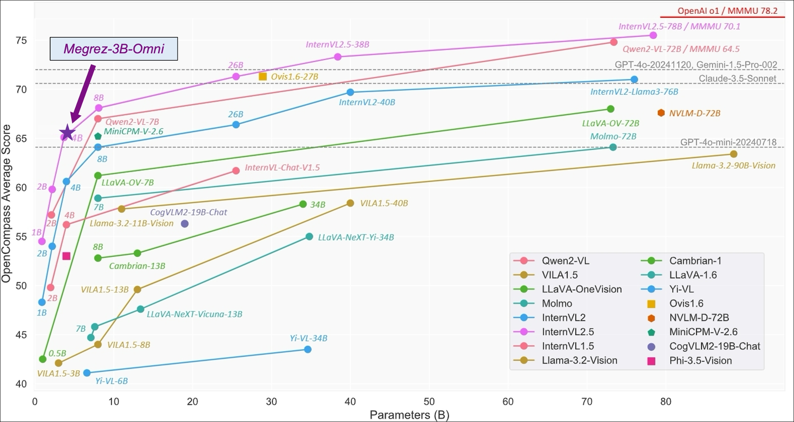

# Megrez-3B: 软硬协同释放无穹端侧智能
<p align="center">
    
<p>
<p align="center">
        🤗 <a href="https://huggingface.co/Infinigence/Megrez-3B-Instruct">HuggingFace</a>&nbsp&nbsp | &nbsp&nbsp🤖 <a href="https://www.modelscope.cn/models/InfiniAI/Megrez-3b-Instruct">ModelScope</a>&nbsp&nbsp | &nbsp&nbsp🧙 <a href="https://modelers.cn/models/INFINIGENCE-AI/Megrez-3B-Instruct">Modelers</a>&nbsp&nbsp <br> &nbsp&nbsp🏠 <a href="https://cloud.infini-ai.com/genstudio/model/mo-c73owqiotql7lozr">Infini-AI mass</a>&nbsp&nbsp | &nbsp&nbsp📖 <a href="https://cloud.infini-ai.com/assets/png/wechat_official_account.1f7e61401727063822266.png">WeChat Official</a>&nbsp&nbsp | &nbsp&nbsp💬 <a href="https://cloud.infini-ai.com/assets/png/wechat_community.7dbbc0b51727063822266.png">WeChat Groups</a>&nbsp&nbsp   
</p>
<h4 align="center">
    <p>
        <b>中文</b> | <a href="https://github.com/infinigence/Infini-Megrez/blob/main/README.md">English</a>
    <p>
</h4>

# 目录

- [模型下载](#模型下载)
- [Megrez-3B](#megrez-3b)
  - [评测结果](#评测结果)
    - [综合能力](#综合评测)
    - [对话能力](#对话能力)
    - [LLM Leaderboard](#llm-leaderboard)
    - [长文本能力](#长文本能力)
  - [模型推理](#模型推理)
    - [HuggingFace Transformers](#🤗-huggingface-transformers)
    - [ModelScope](#🤖-modelscope)
    - [vLLM](#💻-vllm)
  - [模型应用](#模型应用)
    - [Websearch](#websearch)
    - [终端推理](#终端推理)
- [Megrez-3B-Omni](#megrez-3b-omni)
  - [评测结果](#评测结果)
    - [图片理解能力](#图片理解能力)
    - [文本处理能力](#文本处理能力)
    - [语音理解能力](#语音理解能力)
    - [速度](#速度)
  - [快速上手](#快速上手)
    - [在线体验](#在线体验)
    - [本地部署](#本地部署)
    - [注意事项](#注意事项)
- [开源协议及使用声明](#开源协议及使用声明)

# 模型下载

| HuggingFace                                                  | ModelScope                  |
| :----------------------------------------------------------- | --------------------------- |
| [Megrez-3B-Instruct](https://huggingface.co/Infinigence/Megrez-3B-Instruct) | [Megrez-3B-Instruct]()      |
| [Megrez-3B-Instruct-Omni](https://huggingface.co/Infinigence/Megrez-3B-Omni) | [Megrez-3B-Instruct-Omni]() |


# Megrez-3B

Megrez-3B-Instruct是由无问芯穹（[Infinigence AI](https://cloud.infini-ai.com/platform/ai)）完全自主训练的大语言模型。Megrez-3B旨在通过软硬协同理念，打造一款极速推理、小巧精悍、极易上手的端侧智能解决方案。Megrez-3B具有以下优点：

- 高精度：Megrez-3B虽然参数规模只有3B，但通过提升数据质量，成功弥合模型能力代差，将上一代14B模型的能力成功压缩进3B大小的模型，在主流榜单上取得了优秀的性能表现。
- 高速度：模型小≠速度快。Megrez-3B通过软硬协同优化，确保了各结构参数与主流硬件高度适配，推理速度领先同精度模型最大300%。
- 简单易用：模型设计之初我们进行了激烈的讨论：应该在结构设计上留出更多软硬协同的空间（如ReLU、稀疏化、更精简的结构等），还是使用经典结构便于开发者直接用起来？我们选择了后者，即采用最原始的LLaMA结构，开发者无需任何修改便可将模型部署于各种平台，最小化二次开发复杂度。
- 丰富应用：我们提供了完整的WebSearch方案。我们对模型进行了针对性训练，使模型可以自动决策搜索调用时机，在搜索和对话中自动切换，并提供更好的总结效果。我们提供了完整的部署工程代码 [github](https://github.com/infinigence/InfiniWebSearch)，用户可以基于该功能构建属于自己的Kimi或Perplexity，克服小模型常见的幻觉问题和知识储备不足的局限。

## 评测结果
### 综合能力
|         模型        | 指令模型 |  Non-Emb Params | 推理速度 (tokens/s) | C-EVAL | CMMLU | MMLU | MMLU-Pro | HumanEval |  MBPP | GSM8K |  MATH |
|:---------------------:|:--------:|:---------------:|:-------------------:|:------:|:-----:|:-----:|:--------:|:---------:|:-----:|:-----:|:-----:|
| Megrez-3B-Instruct    |     Y    |       2.3       |       2329.4        |  84.8  | 74.7  | 72.8  |   46.1   |   78.7    | 71.0  | 65.5  | 28.3  |
| Qwen2-1.5B            |          |       1.3       |       3299.5        |  70.6  | 70.3  | 56.5  |   21.8   |   31.1    | 37.4  | 58.5  | 21.7  |
| Qwen2.5-1.5B          |          |       1.3       |       3318.8        |    -   |   -   | 60.9  |   28.5   |   37.2    | 60.2  | 68.5  | 35.0  |
| MiniCPM-2B            |          |       2.4       |       1930.8        |  51.1  | 51.1  | 53.5  |     -    |   50.0    | 47.3  | 53.8  | 10.2  |
| Qwen2.5-3B            |          |       2.8       |       2248.3        |    -   |   -   | 65.6  |   34.6   |   42.1    | 57.1  | 79.1  | 42.6  |
| Qwen2.5-3B-Instruct   |     Y    |       2.8       |       2248.3        |    -   |   -   |   -   |   43.7   |   74.4    | 72.7  | 86.7  | 65.9  |
| Qwen1.5-4B            |          |       3.2       |       1837.9        |  67.6  | 66.7  | 56.1  |     -    |   25.6    | 29.2  | 57.0  | 10.0  |
| Phi-3.5-mini-instruct |     Y    |       3.6       |       1559.1        |  46.1  | 46.9  | 69.0  |     -    |   62.8    | 69.6  | 86.2  | 48.5  |
| MiniCPM3-4B           |     Y    |       3.9       |        901.1        |  73.6  | 73.3  | 67.2  |     -    |   74.4    | 72.5  | 81.1  | 46.6  |
| Yi-1.5-6B             |          |       5.5       |       1542.7        |    -   | 70.8  | 63.5  |     -    |   36.5    | 56.8  | 62.2  | 28.4  |
| Qwen1.5-7B            |          |       6.5       |       1282.3        |  74.1  | 73.1  | 61.0  |   29.9   |   36.0    | 51.6  | 62.5  | 20.3  |
| Qwen2-7B              |          |       6.5       |       1279.4        |  83.2  | 83.9  | 70.3  |   40.0   |   51.2    | 65.9  | 79.9  | 44.2  |
| Qwen2.5-7B            |          |       6.5       |       1283.4        |    -   |   -   | 74.2  |   45.0   |   57.9    | 74.9  | 85.4  | 49.8  |
| Meta-Llama-3.1-8B     |          |       7.0       |       1255.9        |    -   |   -   | 66.7  |   37.1   |     -     |   -   |   -   |   -   |
| GLM-4-9B-chat         |     Y    |       8.2       |       1076.1        |  75.6  | 71.5  | 72.4  |     -    |   71.8    |   -   | 79.6  | 50.6  |
| Baichuan2-13B-Base    |          |      12.6       |        756.7        |  58.1  | 62.0  | 59.2  |     -    |   17.1    | 30.2  | 52.8  | 10.1  |
| Qwen1.5-14B           |          |      12.6       |        735.6        |  78.7  | 77.6  | 67.6  |     -    |   37.8    | 44.0  | 70.1  | 29.2  |

- Qwen2-1.5B模型的指标在其论文和Qwen2.5报告中点数不一致，当前采用原始论文中的精度
- 测速配置详见 <a href="https://huggingface.co/Infinigence/Megrez-3B-Instruct/blob/main/README_SPEED.md">README_SPEED.md</a>

     
   
### 对话能力
本表只摘出有官方MT-Bench或AlignBench点数的模型  

| 模型              |  Non-Emb Params   | 推理速度 (tokens/s) | MT-Bench | AlignBench (ZH) |
|:-------------------:|:--------------:|:--------------------------:|:--------:|:---------------:|
| Megrez-3B-Instruct  |      2.3       |          2329.38           |   8.76   |      6.91       |
| MiniCPM-2B-sft-bf16 |      2.4       |          1930.79           |    -     |      4.64       |
| MiniCPM-2B-dpo-bf16 |      2.4       |          1930.79           |   7.25   |        -        |
| Qwen2.5-3B-Instruct |      2.8       |          2248.33           |    -     |        -        |
|     MiniCPM3-4B     |      3.9       |           901.05           |   8.41   |      6.74       |
|   Yi-1.5-6B-Chat    |      5.5       |          1542.66           |   7.5    |       6.2       |
|   Qwen1.5-7B-Chat   |      6.5       |          1282.27           |   7.6    |       6.2       |
|    Qwen2-7B-Chat    |      6.5       |          1279.37           |   8.41   |      7.21       |
| Qwen2.5-7B-Instruct |      6.5       |          1283.37           |   8.75   |        -        |
|    GLM4-9B-Chat     |      8.2       |          1076.13           |   8.35   |      7.01       |
| Baichuan2-13B-Chat  |      12.6      |           756.71           |    -     |      5.25       |

### LLM Leaderboard

| 模型                | Non-Emb Params | 推理速度 (tokens/s) | IFeval strict-prompt |  BBH | ARC_C | HellaSwag | WinoGrande | TriviaQA |
| :--------------------: | :------------: | :------------------------: | :----: | :---: | :---: | :-------: | :--------: | :------: |
|   Megrez-3B-Instruct   |      2.3       |          2329.38           |  78.4  | 61.0  | 90.9  |   83.6    |    72.7    |   82.5   |
|       MiniCPM-2B       |      2.4       |          1930.79           |   -    | 36.9  | 68.0  |   68.3    |     -      |   32.5   |
|       Qwen2.5-3B       |      2.8       |          2248.33           |   -    | 56.3  | 56.5  |   74.6    |    71.1    |    -     |
|  Qwen2.5-3B-instruct   |      2.8       |          2248.33           |  58.2  |   -   |   -   |     -     |     -      |    -     |
| Phi-3.5-mini-instruct  |      3.6       |          1559.09           |   -    | 69.0  | 84.6  |   69.4    |    68.5    |    -     |
|      MiniCPM3-4B       |      3.9       |           901.05           |  68.4  | 70.2  |   -   |     -     |     -      |    -     |
|     Qwen2-7B-Chat      |      6.5       |          1279.37           |   -    | 62.6  | 60.6  |   80.7    |    77.0    |    -     |
| Meta-Llama-3.1-8B-inst |      7.0       |          1255.91           |  71.5  | 28.9  | 83.4  |     -     |     -      |    -     |

### 长文本能力
#### Longbench 

|                       | 单文档问答 | 多文档问答 | 概要任务 | 少样本学习 | 人工合成任务 | 代码任务  | 平均 |
|:---------------------:|:------------------:|:-----------------:|:-------------:|:-----------------:|:---------------:|:----------------:|:-------:|
| Megrez-3B-Instruct    |        39.7        |        55.5       |     24.5     |       62.5        |        68.5     |       66.7       |  52.9  |
| GPT-3.5-Turbo-16k     |        50.5        |        33.7       |     21.3     |       48.1        |       54.1      |       54.1       |  43.6  |
| ChatGLM3-6B-32k       |        51.3        |        45.7       |     23.7     |       55.1        |       56.2      |       56.2       |  48.0  |
| InternLM2-Chat-7B-SFT |        47.3        |        45.2       |     25.3     |       59.9        |       67.2      |       43.5       |  48.1  |

#### 长文本对话能力 

|                          | Longbench-Chat |
|:--------------------------:|:--------------:|
| Megrez-3B-Instruct       | 4.98           |
| Vicuna-7b-v1.5-16k       | 3.51           |
| Mistral-7B-Instruct-v0.2 | 5.84           |
| ChatGLM3-6B-128k         | 6.52           |
| GLM-4-9B-Chat            | 7.72           |


## 模型推理

推荐安装版本
```
torch==2.1.2
numpy==1.26.4
transformers==4.44.2
accelerate==0.34.2
vllm==0.6.1.post2
```

#### 🤗 HuggingFace Transformers
```python
import torch
from transformers import AutoTokenizer, AutoModelForCausalLM

model_path = "Infinigence/Megrez-3B-Instruct"
device = "cuda"
tokenizer = AutoTokenizer.from_pretrained(model_path, trust_romote_code=True)
model = AutoModelForCausalLM.from_pretrained(model_path, torch_dtype=torch.bfloat16, device_map=device, trust_remote_code=True)

messages = [{"role": "user", "content": "How to make braised chicken in brown sauce?"}]
model_inputs = tokenizer.apply_chat_template(messages, return_tensors="pt", add_generation_prompt=True).to(device)
model_outputs = model.generate(
    model_inputs,
    do_sample = True,
    max_new_tokens=2048,
    top_p=0.9,
    temperature=0.2
)

output_token_ids = [
    model_outputs[i][len(model_inputs[i]):] for i in range(len(model_inputs))
]
responses = tokenizer.batch_decode(output_token_ids, skip_special_tokens=True)[0]
print(responses)
```

#### 🤖 ModelScope
```python
import torch
from modelscope import AutoTokenizer, AutoModelForCausalLM

model_path = "Infinigence/Megrez-3B-Instruct"
device = "cuda"
tokenizer = AutoTokenizer.from_pretrained(model_path, trust_romote_code=True)
model = AutoModelForCausalLM.from_pretrained(model_path, torch_dtype=torch.bfloat16, device_map=device, trust_remote_code=True)

messages = [{"role": "user", "content": "How to make braised chicken in brown sauce?"}]
model_inputs = tokenizer.apply_chat_template(messages, return_tensors="pt", add_generation_prompt=True).to(device)
model_outputs = model.generate(
    model_inputs,
    do_sample = True,
    max_new_tokens=2048,
    top_p=0.9,
    temperature=0.2
)

output_token_ids = [
    model_outputs[i][len(model_inputs[i]):] for i in range(len(model_inputs))
]
responses = tokenizer.batch_decode(output_token_ids, skip_special_tokens=True)[0]
print(responses)
```

#### 💻 vLLM
```python
from transformers import AutoTokenizer
from vllm import LLM, SamplingParams

model_name = "Infinigence/Megrez-3B-Instruct"
tokenizer = AutoTokenizer.from_pretrained(model_name, trust_remote_code=True)
llm = LLM(
    model=model_name,
    trust_remote_code=True,
    tensor_parallel_size=1
)

messages = [{"role": "user", "content": "How to make braised chicken in brown sauce?"}]
input_text = tokenizer.apply_chat_template(messages, tokenize=False, add_generation_prompt=True)
sampling_params = SamplingParams(top_p=0.9, temperature=0.2, max_tokens=2048)
outputs = llm.generate(prompts=input_text, sampling_params=sampling_params)

print(outputs[0].outputs[0].text)
```
## 模型应用

<div id = "websearch"></div><details><summary><b>Web-Search Agent</b></summary>
我们模型进行了针对性训练，并提供了完整的工程部署方案。InfiniWebSearch 具有以下优势：

1. 自动决定调用时机：自动决策搜索调用时机，在搜索和对话中自动切换，避免一直调用或一直不调用
2. 上下文理解：根据多轮对话生成合理的搜索query或处理搜索结果，更好的理解用户意图
3. 带参考信息的结构化输出：每个结论注明出处，便于查验
4.一个模型两种用法：通过sys prompt区分WebSearch功能开启与否，兼顾LLM的高精度与WebSearch的用户体验，两种能力不乱窜  

我们对模型进行了针对性训练，使模型可以自动决策搜索调用时机，在搜索和对话中自动切换，并提供更好的总结效果。我们提供了完整的部署工程代码 ，用户可以基于该功能构建属于自己的Kimi或Perplexity，克服小模型常见的幻觉问题和知识储备不足的局限。
<div align="center">
    
</div>
</details>

<div id = "终端推理"></div><details><summary><b>终端推理</b></summary>
MLCChat 是一款设备内置聊天应用，即将上线。
<div align="center">
    
</div>
</details>


# Megrez-3B-Omni

我们同时开源了相应的多模模型，**Megrez-3B-Omni**。  
Megrez-3B-Omni是由无问芯穹（[Infinigence AI](https://cloud.infini-ai.com/platform/ai)）研发的**端侧全模态**理解模型，基于无问大语言模型Megrez-3B-Instruct扩展，同时具备图片、文本、音频三种模态数据的理解分析能力，在三个方面均取得最优精度
- 在图像理解方面，基于SigLip-400M构建图像Token，在OpenCompass榜单上（综合8个主流多模态评测基准）平均得分66.2，超越LLaVA-NeXT-Yi-34B等更大参数规模的模型。Megrez-3B-Omni也是在MME、MMMU、OCRBench等测试集上目前精度最高的图像理解模型之一，在场景理解、OCR等方面具有良好表现。
- 在语言理解方面，Megrez-3B-Omni并未牺牲模型的文本处理能力，综合能力较单模态版本（Megrez-3B-Instruct）精度变化小于2%，保持在C-EVAL、MMLU (Pro）、AlignBench等多个测试集上的最优精度优势，依然取得超越上一代14B模型的能力表现
- 在语音理解方面，采用Whisper-large-v3的Encoder作为语音输入，支持中英文语音输入及多轮对话，支持对输入图片的语音提问，根据语音指令直接响应文本，在多项基准任务上取得了领先的结果

## 评测结果
### 图片理解能力

左图为Megrez-3B-Omni与其他开源模型在图片理解各任务的能力比较；  
右图为Megrez-3B-Omni在opencompass测试集上表现，参考 [InternVL 2.5 Blog Post](https://internvl.github.io/blog/2024-12-05-InternVL-2.5/)*

 <div style="display: flex; justify-content: space-between;">
  
  
</div>

<!-- 

 -->

| model                 | basemodel             | 发布时间       | OpenCompass (在线) | MME      | MMMU val  | OCRBench | Math-Vista-Mini | RealWorldQA | MMVet  | hallusionBench | MMB TEST(en) | MMB TEST(zh) | TextVQA val | AI2D_TEST | MMstar    | DocVQA_TEST |
|:-----------------------:|:-----------------------:|:----------------:|:--------------------:|:----------:|:-----------:|:----------:|:-----------------:|:-------------:|:--------:|:----------------:|:--------------:|:--------------:|:-------------:|:-----------:|:-----------:|:-------------:|
| **Megrez-3B-Omni**    | **Megrez-3B**         | **2024.12.16** | **66.2**           | **2315** | **51.89** | **82.8** | **62**          | **71.89**   | **60** | **50.12**      | **80.8**     | **82.3**     | **80.3**    | **82.05** | **60.46** | **91.62**   |
| Qwen2-VL-2B-Instruct  | Qwen2-1.5B            | 2024.08.28     | 57.2               | 1872     | 41.1      | 79.4     | 43              | 62.9        | 49.5   | 41.7           | 74.9         | 73.5         | 79.7        | 74.7      | 48        | 90.1        |
| InternVL2.5-2B        | Internlm2.5-1.8B-chat | 2024.12.06     | 59.9               | 2138     | 43.6      | 80.4     | 51.3            | 60.1        | 60.8   | 42.6           | 74.7         | 71.9         | 74.3        | 74.9      | 53.7      | 88.7        |
| BlueLM-V-3B           | -                     | 2024.11.29     | 66.1               | -        | 45.1      | 82.9     | 60.8            | 66.7        | 61.8   | 48             | 83           | 80.5         | 78.4        | 85.3      | 62.3      | 87.8        |
| InternVL2.5-4B        | Qwen2.5-3B-Instruct   | 2024.12.06     | 65.1               | 2337     | 52.3      | 82.8     | 60.5            | 64.3        | 60.6   | 46.3           | 81.1         | 79.3         | 76.8        | 81.4      | 58.3      | 91.6        |
| Baichuan-Omni         | Unknown-7B            | 2024.10.11     | -                  | 2186     | 47.3      | 70.0     | 51.9            | 62.6        | 65.4   | 47.8           | 76.2         | 74.9         | 74.3        | -         | -         | -           |
| MiniCPM-V-2.6         | Qwen2-7B              | 2024.08.06     | 65.2               | 2348     | 49.8      | 85.2     | 60.6            | 69.7        | 60     | 48.1           | 81.2         | 79           | 80.1        | 82.1      | 57.26     | 90.8        |
| Qwen2-VL-7B-Instruct  | Qwen2-7B              | 2024.08.28     | 67                 | 2326     | 54.1      | 84.5     | 58.2            | 70.1        | 62     | 50.6           | 83           | 80.5         | 84.3        | 83        | 60.7      | 94.5        |
| MiniCPM-Llama3-V-2.5  | Llama3-Instruct 8B    | 2024.05.20     | 58.8               | 2024     | 45.8      | 72.5     | 54.3            | 63.5        | 52.8   | 42.4           | 77.2         | 74.2         | 76.6        | 78.4      | -         | 84.8        |
| VITA                  | Mixtral 8x7B          | 2024.08.12     | -                  | 2097     | 47.3      | 67.8     | 44.9            | 59          | 41.6   | 39.7           | 74.7         | 71.4         | 71.8        | -         | -         | -           |
| GLM-4V-9B             | GLM-4-9B              | 2024.06.04     | 59.1               | 2018     | 46.9      | 77.6     | 51.1            | -           | 58     | 46.6           | 81.1         | 79.4         | -           | 81.1      | 58.7      | -           |
| LLaVA-NeXT-Yi-34B     | Yi-34B                | 2024.01.18     | 55                 | 2006     | 48.8      | 57.4     | 40.4            | 66          | 50.7   | 34.8           | 81.1         | 79           | 69.3        | 78.9      | 51.6      | -           |
| Qwen2-VL-72B-Instruct | Qwen2-72B             | 2024.08.28     | 74.8               | 2482     | 64.5      | 87.7     | 70.5            | 77.8        | 74     | 58.1           | 86.5         | 86.6         | 85.5        | 88.1      | 68.3      | 96.5        |

### 文本处理能力

|                       |          |             |                                       | 对话&指令 |                 |        | 中文&英文任务 |            |       |          |  代码任务 |       | 数学任务 |       |
|:---------------------:|:--------:|:-----------:|:-------------------------------------:|:---------:|:---------------:|:------:|:-------------:|:----------:|:-----:|:--------:|:---------:|:-----:|:--------:|:-----:|
|         models        | 指令模型 |   发布时间  | Transformer参数量 （不含emb&softmax） |  MT-Bench | AlignBench (ZH) | IFEval |  C-EVAL (ZH)  | CMMLU (ZH) | MMLU  | MMLU-Pro | HumanEval |  MBPP |   GSM8K  |  MATH |
| Megrez-3B-Omni        |     Y    |  2024.12.16 |                  2.3                  |    8.4    |       6.5       |  66.5  |     84.0      |    75.3    | 73.3  |   45.2   |   72.6    | 60.6  |   63.8   | 27.3  |
| Megrez-3B-Instruct    |     Y    |  2024.12.16 |                  2.3                  |   8.64    |      7.06       |  68.6  |     84.8      |    74.7    | 72.8  |   46.1   |   78.7    | 71.0  |   65.5   | 28.3  |
| Baichuan-Omni         |     Y    |  2024.10.11 |                  7.0                  |     -     |        -        |    -   |     68.9      |    72.2    |  65.3 |     -    |     -     |   -   |     -    |   -   |
| VITA                  |     Y    |  2024.08.12 |                 12.9                  |     -     |        -        |    -   |     56.7      |    46.6    | 71.0  |     -    |     -     |   -   |   75.7   |   -   |
| Qwen1.5-7B            |          |  2024.02.04 |                  6.5                  |     -     |        -        |    -   |     74.1      |    73.1    | 61.0  |   29.9   |   36.0    | 51.6  |   62.5   | 20.3  |
| Qwen1.5-7B-Chat       |     Y    |  2024.02.04 |                  6.5                  |   7.60    |      6.20       |    -   |     67.3      |      -     | 59.5  |   29.1   |   46.3    | 48.9  |   60.3   | 23.2  |
| Qwen1.5-14B           |          |  2024.02.04 |                 12.6                  |     -     |        -        |    -   |     78.7      |    77.6    | 67.6  |     -    |   37.8    | 44.0  |   70.1   | 29.2  |
| Qwen1.5-14B-Chat      |     Y    |  2024.02.04 |                 12.6                  |    7.9    |        -        |    -   |       -       |      -     |   -   |     -    |     -     |   -   |     -    |   -   |
| Qwen2-7B              |          |  2024.06.07 |                  6.5                  |     -     |        -        |    -   |     83.2      |    83.9    | 70.3  |   40.0   |   51.2    | 65.9  |   79.9   | 44.2  |
| Qwen2-7b-Instruct     |     Y    |  2024.06.07 |                  6.5                  |   8.41    |      7.21       |  51.4  |     80.9      |    77.2    | 70.5  |   44.1   |   79.9    | 67.2  |   85.7   | 52.9  |
| Qwen2.5-3B-Instruct   |     Y    |  2024.9.19  |                  2.8                  |     -     |        -        |    -   |       -       |      -     |   -   |   43.7   |   74.4    | 72.7  |   86.7   | 65.9  |
| Qwen2.5-7B            |          |  2024.9.19  |                  6.5                  |     -     |        -        |    -   |       -       |      -     | 74.2  |   45.0   |   57.9    | 74.9  |   85.4   | 49.8  |
| Qwen2.5-7B-Instruct   |     Y    |  2024.09.19 |                  6.5                  |   8.75    |        -        |  74.9  |       -       |      -     |   -   |   56.3   |   84.8    | 79.2  |   91.6   | 75.5  |
| Llama-3.1-8B          |          |  2024.07.23 |                  7.0                  |    8.3    |       5.7       |  71.5  |     55.2      |    55.8    | 66.7  |   37.1   |     -     |   -   |   84.5   | 51.9  |
| Llama-3.2-3B          |          |  2024.09.25 |                  2.8                  |     -     |        -        |  77.4  |       -       |      -     | 63.4  |     -    |     -     |   -   |   77.7   | 48.0  |
| Phi-3.5-mini-instruct |     Y    |  2024.08.23 |                  3.6                  |    8.6    |       5.7       |  49.4  |     46.1      |    46.9    | 69.0  |   47.4   |   62.8    | 69.6  |   86.2   | 48.5  |
| MiniCPM3-4B           |     Y    |  2024.09.05 |                  3.9                  |   8.41    |      6.74       |  68.4  |     73.6      |    73.3    | 67.2  |     -    |   74.4    | 72.5  |   81.1   | 46.6  |
| Yi-1.5-6B-Chat        |     Y    |  2024.05.11 |                  5.5                  |   7.50    |      6.20       |    -   |     74.2      |    74.7    | 61.0  |     -    |   64.0    | 70.9  |   78.9   | 40.5  |
| GLM-4-9B-chat         |     Y    |  2024.06.04 |                  8.2                  |   8.35    |      7.01       |  64.5  |     75.6      |    71.5    | 72.4  |     -    |   71.8    |   -   |   79.6   | 50.6  |
| Baichuan2-13B-Base    |          |  2023.09.06 |                 12.6                  |     -     |      5.25       |    -   |     58.1      |    62.0    | 59.2  |     -    |   17.1    | 30.2  |   52.8   | 10.1  |

注：Qwen2-1.5B模型的指标在论文和Qwen2.5报告中点数不一致，当前采用原始论文中的精度


### 语音理解能力

|       Model      |     Base model     | Realease Time | Fleurs test-zh | WenetSpeech test_net | WenetSpeech test_meeting |
|:----------------:|:------------------:|:-------------:|:--------------:|:--------------------:|:------------------------:|
| Whisper-large-v3 |          -         |   2023.11.06  |      12.4      |         17.5         |           30.8           |
|  Qwen2-Audio-7B  |      Qwen2-7B      |   2024.08.09  |        9       |          11          |           10.7           |
|  Baichuan2-omni  |     Unknown-7B     |   2024.10.11  |        7       |          6.9         |            8.4           |
|       VITA       |    Mixtral 8x7B    |   2024.08.12  |        -       |      -/12.2(CER)     |        -/16.5(CER)       |
|  Megrez-3B-Omni  | Megrez-3B-Instruct |   2024.12.16  |      10.8      |           -          |           16.44          |


### 速度

|                | image_tokens | prefill (tokens/s) | decode (tokens/s) |
|:--------------:|:------------:|:------------------:|:-----------------:|
| Megrez-3B-Omni |      448     |       6312.66      |       1294.9      |
| Qwen2-VL-2B    |     1378     |       7349.39      |       685.66      |
| MiniCPM-V-2_6  |      448     |       2167.09      |       452.51      |

实验设置： 
- 测试环境：NVIDIA H100，vLLM下输入128个Text token和一张1480x720大小图片，输出128个token，num_seqs固定为8
- Qwen2-VL-2B虽然其具备更小尺寸的基座模型，但编码上述大小图片后的image_token相较Megrez-3B-Omni多很多，导致此实验下的decode速度小于Megrez-3B-Omni


## 快速上手

### 在线体验

[HF Chat Demo](https://huggingface.co/spaces/Infinigence/Infinigence-AI-Chat-Demo)

### 本地部署

环境安装和Vllm推理代码等部署问题可以参考 [Infini-Megrez-Omni](https://github.com/infinigence/Infini-Megrez-Omni)

如下是一个使用transformers进行推理的例子，通过在content字段中分别传入text、image和audio，可以图文/图音等多种模态和模型进行交互。
```python
import torch
from transformers import AutoModelForCausalLM

path = "{{PATH_TO_PRETRAINED_MODEL}}"  # Change this to the path of the model.

model = (
    AutoModelForCausalLM.from_pretrained(
        path,
        trust_remote_code=True,
        torch_dtype=torch.bfloat16,
        attn_implementation="flash_attention_2",
    )
    .eval()
    .cuda()
)

# Chat with text and image
messages = [
    {
        "role": "user",
        "content": {
            "text": "Please describe the content of the image.",
            "image": "./data/sample_image.jpg",
        },
    },
]

# Chat with audio and image
messages = [
    {
        "role": "user",
        "content": {
            "image": "./data/sample_image.jpg",
            "audio": "./data/sample_audio.m4a",
        },
    },
]

MAX_NEW_TOKENS = 100
response = model.chat(
    messages,
    sampling=False,
    max_new_tokens=MAX_NEW_TOKENS,
    temperature=0,
)
print(response)

```

## 注意事项
1. 图片输入下，只支持首轮输入；语音和文本可以自由切换
2. ASR拼法
3. OCR场景下我们推荐关闭采样进行推理，即sampling=False


# 开源协议及使用声明
- 协议：本仓库中代码依照 [Apache-2.0](https://www.apache.org/licenses/LICENSE-2.0) 协议开源。
- 幻觉：大模型天然存在幻觉问题，用户使用过程中请勿完全相信模型生成的内容。
- 价值观及安全性：本模型已尽全力确保训练过程中使用的数据的合规性，但由于数据的大体量及复杂性，仍有可能存在一些无法预见的问题。如果出现使用本开源模型而导致的任何问题，包括但不限于数据安全问题、公共舆论风险，或模型被误导、滥用、传播或不当利用所带来的任何风险和问题，我们将不承担任何责任。

