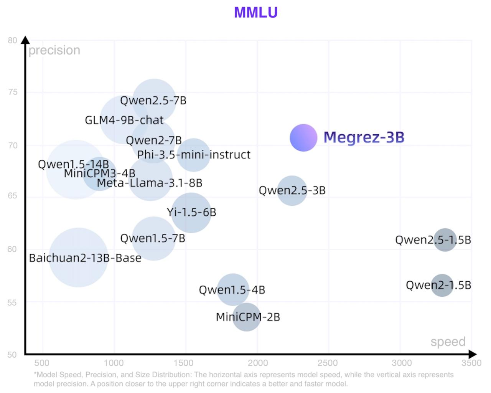
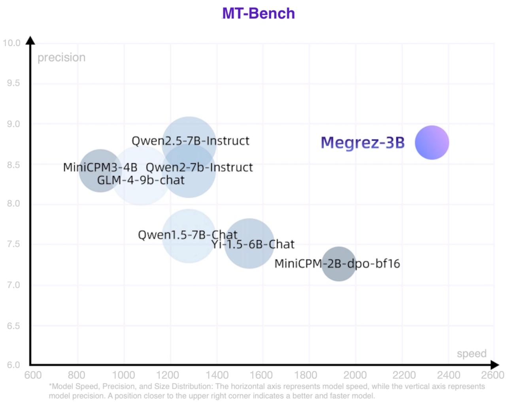
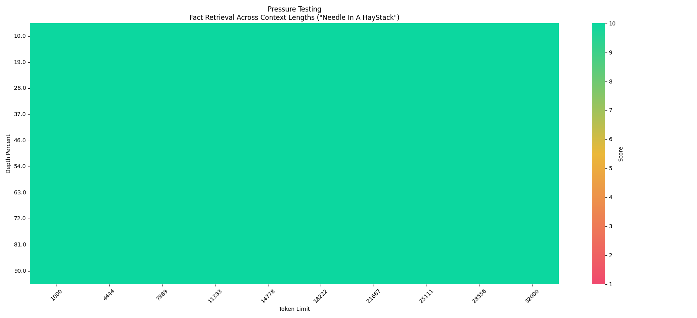

# Megrez-3B-Instruct

<p align="center">
    
<p>
<p align="center">
        🔗 <a href="https://github.com/infinigence/Infini-Megrez">GitHub</a>&nbsp&nbsp | &nbsp&nbsp
        🏠 <a href="https://cloud.infini-ai.com/genstudio/model/mo-c73owqiotql7lozr">Infini-AI mass</a>&nbsp&nbsp | &nbsp&nbsp
        📖 <a href="https://huggingface.co/Infinigence/Megrez-3B-Instruct/blob/main/assets/wechat-official.jpg">WeChat Official</a>&nbsp&nbsp | &nbsp&nbsp
        💬 <a href="https://huggingface.co/Infinigence/Megrez-3B-Instruct/blob/main/assets/wechat-group.jpg">WeChat Groups</a>&nbsp&nbsp   
</p>
<h4 align="center">
    <p>
        <a href="https://github.com/infinigence/Infini-Megrez/blob/main/megrez/README.md">中文</a> | <b>English</b>
    <p>
</h4>

## Introduction
Megrez-3B-Instruct is a large language model trained by [Infinigence AI](https://cloud.infini-ai.com/platform/ai). Megrez-3B aims to provide a fast inference, compact, and powerful edge-side intelligent solution through software-hardware co-design. Megrez-3B has the following advantages:
1. High Accuracy: Megrez-3B successfully compresses the capabilities of the previous 14 billion model into a 3 billion size, and achieves excellent performance on mainstream benchmarks.
2. High Speed: A smaller model does not necessarily bring faster speed. Megrez-3B ensures a high degree of compatibility with mainstream hardware through software-hardware co-design, leading an inference speedup up to 300% compared to previous models of the same accuracy.
3. Easy to Use: In the beginning, we had a debate about model design: should we design a unique but efficient model structure, or use a classic structure for ease of use? We chose the latter and adopt the most primitive LLaMA structure, which allows developers to deploy the model on various platforms without any modifications and minimize the complexity of future development.
4. Rich Applications: We have provided a fullstack WebSearch solution. Our model is functionally trained on web search tasks, enabling it to automatically determine the timing of search invocations and provide better summarization results. The complete deployment code is released on [github](https://github.com/infinigence/InfiniWebSearch).

## Model Card
* Model name: Megrez-3B-Instruct
* Architecture: Llama-2 with GQA  
* Context length: 32K tokens  
* Params (Total): 2.92B  
* Params (Backbone only, w/o Emb or Softmax): 2.29B  
* Vocab Size: 122880  
* Training data: 3T tokens  
* Supported languages: Chinese & English  

## Performance
We evaluated Megrez-3B-Instruct using the open-source evaluation tool [OpenCompass](https://github.com/open-compass/opencompass) on several important benchmarks. Some of the evaluation results are shown in the table below.

The scatter plot of speed, accuracy and model size is roughly as follows. The point size represents the number of model parameters.



### General Benchmarks
|        Models         | chat model | # Non-Emb Params | Decode Speed (tokens/s) | C-EVAL | CMMLU | MMLU  | MMLU-Pro | HumanEval | MBPP  | GSM8K | MATH  |
|:---------------------:|:--------:|:---------------:|:-------------------:|:------:|:-----:|:-----:|:--------:|:---------:|:-----:|:-----:|:-----:|
| Megrez-3B-Instruct    |     Y    |       2.3       |       2329.4        |  84.8  | 74.7  | 72.8  |   46.1   |   78.7    | 71.0  | 65.5  | 28.3  |
| Qwen2-1.5B            |          |       1.3       |       3299.5        |  70.6  | 70.3  | 56.5  |   21.8   |   31.1    | 37.4  | 58.5  | 21.7  |
| Qwen2.5-1.5B          |          |       1.3       |       3318.8        |    -   |   -   | 60.9  |   28.5   |   37.2    | 60.2  | 68.5  | 35.0  |
| MiniCPM-2B            |          |       2.4       |       1930.8        |  51.1  | 51.1  | 53.5  |     -    |   50.0    | 47.3  | 53.8  | 10.2  |
| Qwen2.5-3B            |          |       2.8       |       2248.3        |    -   |   -   | 65.6  |   34.6   |   42.1    | 57.1  | 79.1  | 42.6  |
| Qwen2.5-3B-Instruct   |     Y    |       2.8       |       2248.3        |    -   |   -   |   -   |   43.7   |   74.4    | 72.7  | 86.7  | 65.9  |
| Qwen1.5-4B            |          |       3.2       |       1837.9        |  67.6  | 66.7  | 56.1  |     -    |   25.6    | 29.2  | 57.0  | 10.0  |
| Phi-3.5-mini-instruct |     Y    |       3.6       |       1559.1        |  46.1  | 46.9  | 69.0  |     -    |   62.8    | 69.6  | 86.2  | 48.5  |
| MiniCPM3-4B           |     Y    |       3.9       |        901.1        |  73.6  | 73.3  | 67.2  |     -    |   74.4    | 72.5  | 81.1  | 46.6  |
| Yi-1.5-6B             |          |       5.5       |       1542.7        |    -   | 70.8  | 63.5  |     -    |   36.5    | 56.8  | 62.2  | 28.4  |
| Qwen1.5-7B            |          |       6.5       |       1282.3        |  74.1  | 73.1  | 61.0  |   29.9   |   36.0    | 51.6  | 62.5  | 20.3  |
| Qwen2-7B              |          |       6.5       |       1279.4        |  83.2  | 83.9  | 70.3  |   40.0   |   51.2    | 65.9  | 79.9  | 44.2  |
| Qwen2.5-7B            |          |       6.5       |       1283.4        |    -   |   -   | 74.2  |   45.0   |   57.9    | 74.9  | 85.4  | 49.8  |
| Meta-Llama-3.1-8B     |          |       7.0       |       1255.9        |    -   |   -   | 66.7  |   37.1   |     -     |   -   |   -   |   -   |
| GLM-4-9B-chat         |     Y    |       8.2       |       1076.1        |  75.6  | 71.5  | 72.4  |     -    |   71.8    |   -   | 79.6  | 50.6  |
| Baichuan2-13B-Base    |          |      12.6       |        756.7        |  58.1  | 62.0  | 59.2  |     -    |   17.1    | 30.2  | 52.8  | 10.1  |
| Qwen1.5-14B           |          |      12.6       |        735.6        |  78.7  | 77.6  | 67.6  |     -    |   37.8    | 44.0  | 70.1  | 29.2  |

- The metrics of the Qwen2-1.5B model are inconsistent between its paper and the latest report; the table adopts the metrics from the original paper.
- For details on the configuration for measuring speed, please refer to <a href="https://huggingface.co/Infinigence/Megrez-3B-Instruct/blob/main/README_SPEED.md">README_SPEED.md</a>

### Chat Benchmarks
This table only includes models with official MT-Bench or AlignBench benchmarks.

|       Models        | # Non-Emb Params | Decode Speed (tokens/s) | MT-Bench | AlignBench (ZH) |
|:---------------------:|:--------------------------------------:|:--------------------------:|:--------:|:---------------:|
| Megrez-3B-Instruct  |                 2.3                  |           2329.4           |   8.64   |      7.06       |
| MiniCPM-2B-sft-bf16 |                 2.4                  |           1930.8           |     -    |      4.64       |
| MiniCPM-2B-dpo-bf16 |                 2.4                  |           1930.8           |   7.25   |        -        |
| Qwen2.5-3B-Instruct |                 2.8                  |           2248.3           |     -    |        -        |
| MiniCPM3-4B         |                 3.9                  |           901.1            |   8.41   |      6.74       |
| Yi-1.5-6B-Chat      |                 5.5                  |           1542.7           |   7.50   |      6.20       |
| Qwen1.5-7B-Chat     |                 6.5                  |           1282.3           |   7.60   |      6.20       |
| Qwen2-7b-Instruct   |                 6.5                  |           1279.4           |   8.41   |      7.21       |
| Qwen2.5-7B-Instruct |                 6.5                  |           1283.4           |   8.75   |        -        |
| glm-4-9b-chat       |                 8.2                  |           1076.1           |   8.35   |      7.01       |
| Baichuan2-13B-Chat  |                 12.6                 |           756.7            |     -    |      5.25       |

### LLM Leaderboard
|         Models         | # Non-Emb Params | Inference Speed (tokens/s) | IFEval |  BBH  | ARC_C | HellaSwag | WinoGrande | TriviaQA |
|:-----------------------:|:--------------------------------------:|:--------------------------:|:--------------------:|:----:|:-----:|:---------:|:----------:|:--------:|
| Megrez-3B-Instruct    |                 2.3                  |           2329.4           |         68.6         | 72.6 |  95.6 |    83.9   |    78.8    |   81.6   |
| MiniCPM-2B            |                 2.4                  |           1930.8           |           -          | 36.9 |  68.0 |    68.3   |      -     |   32.5   |
| Qwen2.5-3B            |                 2.8                  |           2248.3           |           -          | 56.3 |  56.5 |    74.6   |    71.1    |     -    |
| Qwen2.5-3B-Instruct   |                 2.8                  |           2248.3           |         58.2         |   -  |   -   |     -     |      -     |     -    |
| Phi-3.5-mini-instruct |                 3.6                  |           1559.1           |           -          | 69.0 |  84.6 |    69.4   |    68.5    |     -    |
| MiniCPM3-4B           |                 3.9                  |           901.1            |         68.4         | 70.2 |   -   |     -     |      -     |     -    |
| Qwen2-7B-Instruct     |                 6.5                  |           1279.4           |           -          | 62.6 |  60.6 |    80.7   |    77.0    |     -    |
| Meta-Llama-3.1-8B     |                 7.0                  |           1255.9           |         71.5         | 28.9 |  83.4 |     -     |      -     |     -    |

### Long text Capability
#### Longbench 

|                        | single-document-qa | multi-document-qa | summarization | few-shot-learning | synthetic-tasks | code-completion  | Average |
|:------------------------:|:------------------:|:-----------------:|:-------------:|:-----------------:|:---------------:|:----------------:|:-------:|
| Megrez-3B-Instruct    |        39.7        |        55.5       |      24.5     |        62.5       |        68.5       |       66.7      |  52.9  |
| GPT-3.5-Turbo-16k     |        50.5        |        33.7       |     21.25     |       48.15       |       54.1      |       54.1       |  43.63  |
| ChatGLM3-6B-32k       |        51.3        |        45.7       |     23.65     |       55.05       |       56.2      |       56.2       |  48.02  |
| InternLM2-Chat-7B-SFT |        47.3        |        45.2       |      25.3     |        59.9       |       67.2      |       43.5       |  48.07  |

#### Longbench-Chat 

|                          | Longbench-Chat |
|:--------------------------:|:----------------:|
| Megrez-3B-Instruct       | 4.98           |
| Vicuna-7b-v1.5-16k       | 3.51           |
| Mistral-7B-Instruct-v0.2 | 5.84           |
| ChatGLM3-6B-128k         | 6.52           |
| GLM-4-9B-Chat            | 7.72           |

#### Needle In A Haystack - Pressure Test
Megrez-3B-Instruct passes the 32K text retrieval stress test.


## WebSearch
We have provided a fullstack WebSearch solution which has the following advantages:
1. Automatically determine the timing of search invocations: Switch between search and conversation automatically without tendency.
2. In-Context understanding: Generate reasonable search queries or process search results based on multi-turn conversations.
3. Structured output: Each conclusion is attributed to its source for easy verification.
4. One model with two usages: Enable the WebSearch ability by changing system prompt. Or you can use it as a classic LLM.

Our model is functionally trained on web search tasks. Users can build their own Kimi or Perplexity based on this feature, which overcomes the hallucination issues and gets update knowledge.


## Quick Start
### Online Experience
[MaaS](https://cloud.infini-ai.com/genstudio/model/mo-c73owqiotql7lozr)(recommend) 

### Inference Parameters
- For chat, text generation, and other tasks that benefit from diversity, we recommend to use the inference parameter temperature=0.7.
- For mathematical and reasoning tasks, we recommend to use the inference parameter temperature=0.2 for better determinacy.

### 🤗 Huggingface Inference
``` python
from transformers import AutoModelForCausalLM, AutoTokenizer
import torch

path = "Infinigence/Megrez-3B-Instruct"
device = "cuda"

tokenizer = AutoTokenizer.from_pretrained(path, trust_remote_code=True)
model = AutoModelForCausalLM.from_pretrained(path, torch_dtype=torch.bfloat16, device_map=device, trust_remote_code=True)

messages = [
    {"role": "user", "content": "How to make braised chicken in brown sauce?"},
]
model_inputs = tokenizer.apply_chat_template(messages, return_tensors="pt", add_generation_prompt=True).to(device)

model_outputs = model.generate(
    model_inputs,
    do_sample=True,
    max_new_tokens=1024,
    top_p=0.9,
    temperature=0.2
)

output_token_ids = [
    model_outputs[i][len(model_inputs[i]):] for i in range(len(model_inputs))
]

responses = tokenizer.batch_decode(output_token_ids, skip_special_tokens=True)[0]
print(responses)
```

### 🤖 ModelScope Inference
```python
import torch
from modelscope import AutoTokenizer, AutoModelForCausalLM

model_path = "Infinigence/Megrez-3B-Instruct"
device = "cuda"
tokenizer = AutoTokenizer.from_pretrained(model_path, trust_romote_code=True)
model = AutoModelForCausalLM.from_pretrained(model_path, torch_dtype=torch.bfloat16, device_map=device, trust_remote_code=True)

messages = [{"role": "user", "content": "How to make braised chicken in brown sauce?"}]
model_inputs = tokenizer.apply_chat_template(messages, return_tensors="pt", add_generation_prompt=True).to(device)
model_outputs = model.generate(
    model_inputs,
    do_sample = True,
    max_new_tokens=2048,
    top_p=0.9,
    temperature=0.2
)

output_token_ids = [
    model_outputs[i][len(model_inputs[i]):] for i in range(len(model_inputs))
]
responses = tokenizer.batch_decode(output_token_ids, skip_special_tokens=True)[0]
print(responses)
```


### 💻 vLLM Inference
- Installation
```bash
# Install vLLM with CUDA 12.1.
pip install vllm
```
- Example code
```python
python inference/inference_vllm.py --model_path <hf_repo_path> --prompt_path prompts/prompt_demo.txt
from transformers import AutoTokenizer
from vllm import LLM, SamplingParams

model_name = "Infinigence/Megrez-3B-Instruct"
prompt = [{"role": "user", "content": "How to make braised chicken in brown sauce?"}]

tokenizer = AutoTokenizer.from_pretrained(model_name, trust_remote_code=True)
input_text = tokenizer.apply_chat_template(prompt, tokenize=False, add_generation_prompt=True)

llm = LLM(
    model=model_name,
    trust_remote_code=True,
    tensor_parallel_size=1
)
sampling_params = SamplingParams(top_p=0.9, temperature=0.2, max_tokens=1024, repetition_penalty=1.02)

outputs = llm.generate(prompts=input_text, sampling_params=sampling_params)

print(outputs[0].outputs[0].text)
```

## License and Statement
- License: Our models are released under [Apache-2.0](https://www.apache.org/licenses/LICENSE-2.0).
- Hallucination: LLMs inherently suffer from hallucination issues. Users are advised not to fully trust the content generated by the model. If accurate outputs are required, we recommend utilizing our WebSearch framework as detailed in [InfiniWebSearch](https://github.com/paxionfull/InfiniWebSearch).
- Mathematics & Reasoning: Small LLMs tend to produce more incorrect calculations or flawed reasoning chains in tasks like mathematics and reasoning. Notably, the softmax distribution of Small LLMs is less sharp compared to LLMs, making them more sensitive to inconsistent reasoning results, especially under higher temperature settings. We recommend lowering the temperature or verifying through multiple inference attempts in deterministic tasks such as mathematics and logical reasoning.
- System Prompt: Like other models, we recommend to use the default system prompt in the configuration file's chat_template for a stable and balanced experience. If users have specific domain needs, we recommend making appropriate fine-tuning based on this model as needed.
- Values & Safety: We have made great effort to ensure the compliance of the training data. However, unforeseen issues may still arise. Users should take full responsibility for evaluating and verifying it on their own when using content generated by our model.
